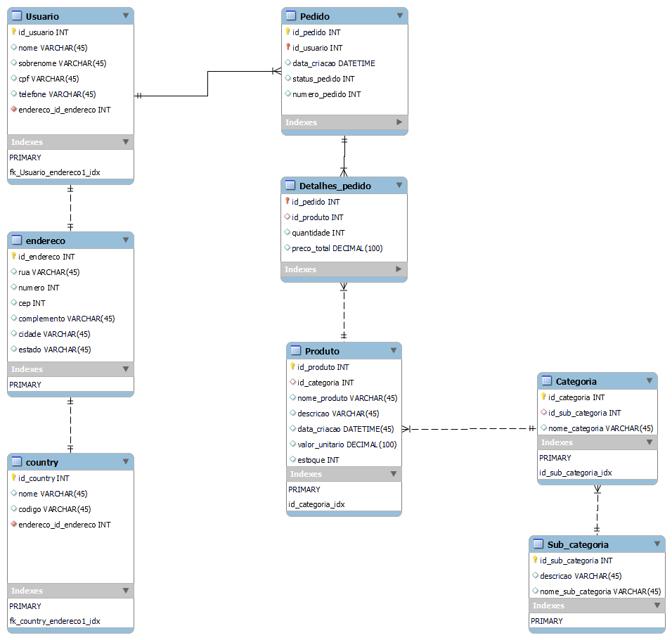

<h1>IBM Shop - Backend</h1>
<h2>User API</h2>

<h2>Modelagem do Banco de Dados</h2>

Aqui vocês podem encontrar todas as entidades do banco de dados, seus atributos e os seus relacionamentos.

<h2>Consulta</h2> 

<h3>Estória</h3>  

<strong>Eu, como</strong> Micro Serviço de Usuário do Sistema de E-commerce IBM

<strong>Quero</strong> consultar um usuário e obter todos os dados no sistema IBM Shop.

<h3>Cenários</h3>

<h3><strong>Cenario  1:</strong> Consulta  por id</h3>

<ul>
   <li>O usuário informa um id existente.</li>
   <ul>
      <li>Retorna os seguintes dados da entidade Usuario:</li>
      <table>
         <tr>
            <th>Campo</th>
            <th>Valor esperado</th>
         </tr>
         <tr>
            <td>id_usuario</td>
            <td>ID da tabela (autoincremento)</td>
         </tr>
         <tr>
            <td>nome</td>
            <td>Nome do usuário</td>
         </tr>
         <tr>
            <td>sobrenome</td>
            <td>Sobrenome do usuário</td>
         </tr>
         <tr>
            <td>telefone</td>
            <td>Telefone do usuário</td>
         </tr>
         <tr>
            <td>cpf</td>
            <td>CPF do usuário</td>
         </tr>
         <tr>
            <td>data_criacao</td>
            <td>Data da criação do usuário</td>
         </tr>
         <tr>
            <td>data_modificacao</td>
            <td>Data de update do usuário</td>
         </tr>
      </table>
   </ul>
</ul>

 
<h3><strong>Cenario  2:</strong> Consulta  por CPF</h3>

<ul>
   <li>O usuário informa um CPF existente e válido.</li>
   <ul>
      <li>Retorna os seguintes dados da entidade Usuario:</li>
      <table>
         <tr>
            <th>Campo</th>
            <th>Valor esperado</th>
         </tr>
         <tr>
            <td>id_usuario</td>
            <td>ID da tabela (autoincremento)</td>
         </tr>
         <tr>
            <td>nome</td>
            <td>Nome do usuário</td>
         </tr>
         <tr>
            <td>sobrenome</td>
            <td>Sobrenome do usuário</td>
         </tr>
         <tr>
            <td>telefone</td>
            <td>Telefone do usuário</td>
         </tr>
         <tr>
            <td>cpf</td>
            <td>CPF do usuário</td>
         </tr>
         <tr>
            <td>data_criacao</td>
            <td>Data da criação do usuário</td>
         </tr>
         <tr>
            <td>data_modificacao</td>
            <td>Data de update do usuário</td>
         </tr>
      </table>
   </ul>
</ul>

<ul>
   <li>O usuário informa um CPF inexistente.</li>
   <ul>
      <li>Retorna uma mensagem: “Desculpe, não foi possível encontrar um usuário com este cpf. Verifique e tente novamente.”</li>
   </ul>

   <li>O usuário informa um CPF em um formato inválido.</li>
   <ul>
      <li>Retorna uma mensagem: “Desculpe, não foi possível realizar a busca por CPF. O CPF não foi digitado corretamente. Verifique e tente novamente.”</li>
      <table>
         <tr>
            <th>Exemplo de <strong>formato</strong> válido de CPF</th>
         </tr>
         <tr>
            <td>123.456.789-10</td>
         </tr>
      </table>
   </ul>

   <li>O usuário não informa um CPF.</li>
   <ul>
      <li>o	Retorna uma mensagem: “Desculpe, não foi possível realizar a busca por CPF. Digite um CPF e tente novamente.”</li>
   </ul>
</ul>

<h3><strong>Cenario  3:</strong> Consulta  por nome</h3>
<ul>
   <li>O usuário informa um nome existente e válido.</li>
   <ul>
      <li>Retorna os seguintes dados da entidade Usuario, para <strong>todos</strong> os registros encontrados:</li>
      <table>
         <tr>
            <th>Campo</th>
            <th>Valor esperado</th>
         </tr>
         <tr>
            <td>id_usuario</td>
            <td>ID da tabela (autoincremento)</td>
         </tr>
         <tr>
            <td>nome</td>
            <td>Nome do usuário</td>
         </tr>
         <tr>
            <td>sobrenome</td>
            <td>Sobrenome do usuário</td>
         </tr>
         <tr>
            <td>telefone</td>
            <td>Telefone do usuário</td>
         </tr>
         <tr>
            <td>cpf</td>
            <td>CPF do usuário</td>
         </tr>
         <tr>
            <td>data_criacao</td>
            <td>Data da criação do usuário</td>
         </tr>
         <tr>
            <td>data_modificacao</td>
            <td>Data de update do usuário</td>
         </tr>
      </table>
   </ul>

   <li>O usuário informa um nome inexistente.</li>
   <ul>
      <li>Retorna uma mensagem: “Não foi possível encontrar um usuário com este nome. Verifique e tente novamente.”</li>
   </ul>

   <li>O usuário informa um nome com menos de 2 caracteres.</li>
   <ul>
      <li>Retorna uma mensagem: “Desculpe, não foi possível realizar a busca por nome. O nome informado deve ter, pelo menos, 2 caracteres.</li>
   </ul>
   
   <li>O usuário não informa um nome.</li>
   <ul>
      <li>Retorna uma mensagem: “Desculpe, não foi possível realizar a busca por nome. Digite um nome e tente novamente.”</li>
   </ul>
</ul>

<h3><strong>Cenario  4:</strong> Usuário não encontrado</h3>
<ul>
   <li>Nenhum Usuario foi encontrado dados os valores informados.</li>
   <ul>
      <li>Retorna uma mensagem: “Nenhum usuário foi encontrado. Verifique e tente novamente.”</li>
   </ul>
</ul>

<h3><strong>Cenario  5:</strong> Campos obrigatórios não preenchidos</h3>
<ul>
   <li>O usuário tenta realizar uma busca sem preencher os campos obrigatórios.</li>
   <ul>
      <li>Retorna uma mensagem: “Não foi possível realizar a busca por usuário. Por favor, preencha os campos obrigatórios e tente novamente.”</li>
   </ul>
</ul>

<h3><strong>Cenario  6:</strong> Informar campos inválidos</h3>
<ul>
   <li>O usuário informa campos inválidos durante uma busca.</li>
   <ul>
      <li>Retorna uma mensagem: “Não foi possível realizar a busca por usuário. O campo “nome_do_campo” não foi preenchido corretamente. Verifique e tente novamente.”</li>
      <ul>
         <li>Obs: Nesse caso, será necessária uma mensagem de erro personalizada para cada atributo.</li>
      </ul>
   </ul>
</ul>

<h2>Manutenção</h2>
Eu como operador (Usuário) do Sistema  de E-commerce IBM Shop. 
Quero realizar,  via tela, manutenção  de usuário  no Sistema  IBM Shop. 
Para poder  realizar  as devidas tratativas  com a entidade: 
Cenários 

<h3>Estória</h3>  

<strong>Eu, como</strong> Micro Serviço de Usuário do Sistema de E-commerce IBM Shop.

<strong>Quero</strong> realizar, via tela, a manutenção de usuário no Sistema IBM Shop.

<h3>Cenários:</h3>
  
<h3><strong>Cenario  1:</strong> cadastrar usuário</h3>
<ul>
   <li>Nome</li>
   <ul>
      <li>Obrigatório</li>
      <li>Deve ter, pelo menos, 2 caracteres.</li>
      <li>Deve ter, no máximo, 255 caracteres.</li>
   </ul>

   <li>Sobrenome</li>
   <ul>
      <li>Obrigatório</li>
      <li>Deve ter, pelo menos, 2 caracteres.</li>
      <li>Deve ter, no máximo, 255 caracteres.</li>
   </ul>

   <li>CPF</li>
   <ul>
      <li>Obrigatório</li>
      <li>Deve estar em um formato válido. (Especificado no Cenário 2: Consulta por CPF)</li>
   </ul>

   <li>Telefone</li>
   <ul>
      <li>Opcional</li>
      <li>Deve estar em um formato válido.</li>
      <table>
         <tr>
            <th>Exemplos de <strong>formato</strong> válido de Telefone</th>
         </tr>
         <tr>
            <td>+xxx (xx) xxxxx-xxxx</td>
         </tr>
         <tr>
            <td>+xxx (xx) xxxx-xxxx</td>
         </tr>
         <tr>
            <td>+xx (xx) xxxxx-xxxx</td>
         </tr>
         <tr>
            <td>+xx (xx) xxxx-xxxx</td>
         </tr>
      </table>
   </ul>

   <li>Endereço</li>
   <ul>
      <li>Rua</li>
      <ul>
         <li>Obrigatório</li>
         <li>Tamanho máximo de 45 caracteres</li>
      </ul>
      <li>Número</li>
      <ul>
         <li>Obrigatório</li>
         <li>Tamanho máximo de 10 caracteres.</li>
      </ul>
      <li>CEP (String)</li>
      <ul>
         <li>Obrigatório</li>
         <li>Deve seguir o seguinte formato: xxxxx-xxx</li>
      </ul>
      <li>Complemento (String)</li>
      <ul>
         <li>Opcional</li>
         <li>Tamanho máximo de 45 caracteres</li>
      </ul>
      <li>Cidade</li>
      <ul>
         <li>Obrigatório</li>
      </ul>
      <li>Estado</li>
      <ul>
         <li>Obrigatório</li>
      </ul>
   </ul>

   <li>Country</li>
   <ul>
      <li>Nome</li>
      <ul>
         <li>Obrigatório</li>
         <li>Tamanho máximo de 45 caracteres</li>
      </ul>
      <li>Código</li>
      <ul>
         <li>Obrigatório</li>
         <li>Tamanho máximo de 45 caracteres</li>
         <li>Deve seguir o seguinte formato: +xxx</li>
      </ul>
   </ul>

   <li>Data criação</li>
   <ul>
      <li>Automático</li>
      <li>A data de criação de um usuário deve ser a data do momento do cadastro.</li>
      <li>Formato: dd/MM/yyyy</li>
   </ul>

   <li>Data modificação</li>
   <ul>
      <li>Automático</li>
      <li>Dentro do contexto de cadastro, a data de modificação de um usuário deve ser, inicialmente, a data do momento do cadastro.</li>
      <ul>
         <li>Essa data será atualizada sempre que houver uma atualização nos dados do usuário.</li>
      </ul>
      <li>Formato: dd/MM/yyyy</li>
   </ul>
</ul>
<h4>Exemplo de uma entrada de objeto Usuario válida em JSON</h4>
<pre>
<code>
{
    "nome": "Nome",
    "sobrenome": "Sobrenome da Silva",
    "telefone": "+055 (11) 12345-1234",
    "cpf": "455.449.218-49",
    "endereco": {
        "rua": "Rua",
        "numero": "12",
        "cep": "00000-000",
        "complemento": "AP 0",
        "cidade": "São Paulo",
        "estado": "São Paulo",
        "country": {
            "nome": "Brasil",
            "codigo": "+055"
        }
    }
}
</code>
</pre>

  
<h3><strong>Cenario  2:</strong> não informar os campos obrigatórios</h3>
<ul>
   <li>Caso o usuário não informe os atributos corretamente deverá receber uma  mensagem de erro  ("Os campos [nome do campo] são obrigatórios"</li>
</ul>
  

<h3><strong>Cenario  3:</strong> informar um usuário já cadastrado</h3>
<ul>
   <li>Quando o usuário informar um CPF já cadastrado deverá receber uma mensagem  ("CPF já castrado no nosso banco de dados") </li>
</ul>

  
<h3><strong>Cenario  4:</strong> editar usuário</h3>
<ul>
   <li>Usuário não pode alterar  CPF deverá receber uma mensagem ("Você não pode  alterar o campo CPF") </li>
   <li>As mesmas validações de POST serão consideradas para PUT </li>
</ul>

<h3><strong>Cenario  5:</strong> excluir usuário</h3>
<ul>
   <li>Quando o usuário informar um id  inexistente deverá receber uma mensagem  ("Usuário não encontrado na nossa base de dados")</li>
</ul>

  
<h3><strong>Cenario  6:</strong> informar campos inválidos</h3>
<ul>
   <li>[Especificado no cenário 1] </li>
</ul>

<h3><strong>Cenario  7:</strong> persistência de Endereço</h3>
<ul>
   <li>Ao cadastrar um usuário, um endereço também deve ser cadastrado.</li>
</ul>

<h3><strong>Cenario  8:</strong> persistência de Country</h3>
<ul>
   <li>Ao cadastrar um usuário, o país só deve ser salvo no banco de dados se ele ainda não existir.</li>
</ul>